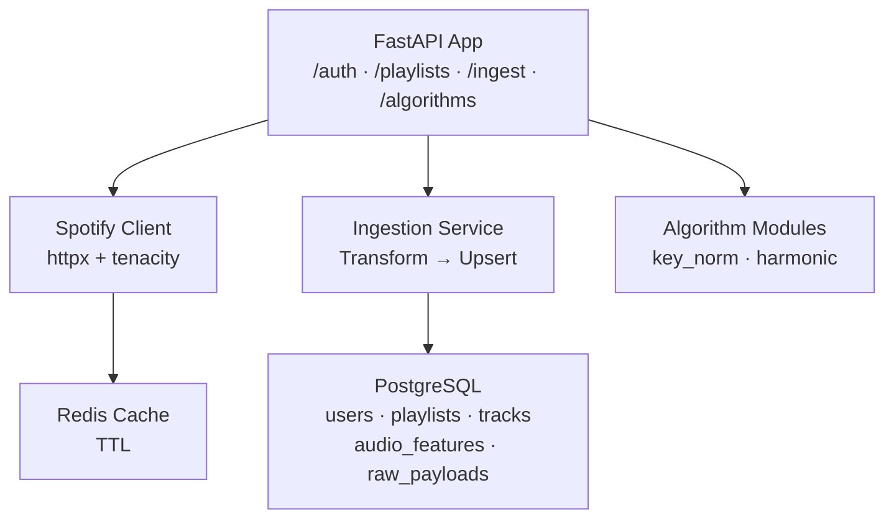

# Tunescope

A music analysis web app built with FastAPI, SQLAlchemy (async), PostgreSQL, Redis, and a vanilla JS frontend. Users connect their Spotify account, ingest playlists, and analyze tracks for BPM, key, energy, danceability, and other audio features. Tracks that the primary analysis source can't cover are processed through a YouTube download → librosa fallback pipeline.

---

## Architecture



### Layer Separation

| Layer | Location | Responsibility |
|---|---|---|
| **Ingestion** | `app/ingestion/` | Spotify API calls, retry/rate-limit logic, YouTube fallback |
| **Transformation** | `app/transformation/` | Raw → normalized domain objects (pure functions) |
| **Storage** | `app/db/` | Models, repositories, upsert strategies |
| **Enrichment** | `app/algorithms/` | Key normalization|
| **Cache** | `app/cache/` | Redis-backed cache-aside pattern |
| **API** | `app/api/` | FastAPI routers exposing the pipeline |

---

## Tech Stack

- **Python 3.11+** + **FastAPI** — async API framework
- **PostgreSQL** + **SQLAlchemy 2 (async)** — primary store with JSONB
- **Pydantic v2** — validation and settings management
- **Redis** — caching with TTLs
- **httpx + tenacity** — resilient HTTP client with exponential backoff
- **yt-dlp + librosa** — YouTube audio download and fallback feature extraction
- **structlog** — structured JSON logging
- **Docker** — dockerization

---

## Project Structure

```
tunescope/
├── app/
│   ├── main.py
│   ├── api/
│   │   ├── schemas.py
│   │   └── routes/
│   │       ├── auth.py            # OAuth flow
│   │       ├── playlists.py       # GET /playlists
│   │       ├── ingestion.py       # Ingestion + analysis endpoints
│   │       └── algorithms.py      # Key finding endpoint
│   ├── core/
│   │   ├── config.py
│   │   └── logging.py
│   ├── db/
│   │   ├── session.py
│   │   ├── models/models.py
│   │   └── repositories/repo.py
│   ├── ingestion/
│   │   ├── spotify_client.py
│   │   ├── ingestion_service.py
│   │   ├── audio_analyzer.py      # ReccoBeats batch client
│   │   └── manual_analyzer.py     # YouTube → librosa fallback
│   ├── transformation/
│   │   └── normalizer.py
│   ├── algorithms/
│   │   └── key_normalization.py
│   └── cache/
│       └── redis_cache.py
├── Dockerfile
├── docker-compose.yml
├── requirements.txt
└── alembic.ini
```

---

## Quick Start

### Prerequisites

- Docker + Docker Compose
- Spotify Developer account: [developer.spotify.com/dashboard](https://developer.spotify.com/dashboard)

### Setup

1. Create a Spotify app and add `http://localhost:8000/auth/callback` as a redirect URI.
2. Copy credentials into `.env`:

```bash
cp .env.example .env
# Fill in SPOTIFY_CLIENT_ID, SPOTIFY_CLIENT_SECRET, SECRET_KEY
```

3. Start the stack:

```bash
docker compose up --build
```

API: `http://localhost:8000` · Docs: `http://localhost:8000/docs`

---

## API Overview

### Authentication

```
GET /auth/login          → redirects to Spotify OAuth
GET /auth/callback       → returns access_token
```

All subsequent requests require:
```
Authorization: Bearer <access_token>
```

### Playlists

```
GET /playlists           → list user's playlists (Redis-cached, 5 min TTL)
```

### Ingestion

```
POST /ingest/playlist/{id}                  → ingest tracks + audio features
GET  /ingest/playlist/{id}/tracks           → return analyzed/missing track split
POST /ingest/playlist/{id}/analyze-missing  → batch YouTube fallback analysis
GET  /ingest/playlist/{id}/analyze-stream   → SSE stream of analysis results
POST /ingest/manual-analyze                 → analyze a single track via YouTube
```

The ingestion pipeline:
1. Fetches all paginated tracks from Spotify
2. Stores raw payloads in `raw_spotify_payloads` (audit trail)
3. Upserts tracks with `ON CONFLICT DO UPDATE`
4. Fetches audio features from ReccoBeats (with Redis cache)
5. Runs YouTube → librosa fallback for anything still missing

Ingestion is idempotent: repeated runs produce the same DB state. Pass `force_refetch: true` to bypass the `snapshot_id` check.

### Algorithms

```
GET /algorithms/key/{track_id}?semitones=7&prefer_flats=true
GET /algorithms/compatibility?track_a_id=xxx&track_b_id=yyy
```

---

## Custom Algorithms

### Key Normalization (`app/algorithms/key_normalization.py`)

Converts Spotify's integer pitch class (0–11) + mode (0/1) into human-readable key names.

```python
normalize_key(8, 1, prefer_flats=True)  # → ("Ab", "major")
transpose_key(0, 7)                      # → 7 (C up a fifth = G)
```

## Design Notes

**Idempotent writes** — all DB writes use `ON CONFLICT DO UPDATE`. Running ingestion twice produces identical state.

**Raw payload storage** — every Spotify response is stored verbatim as JSONB, serving as an audit trail and replay buffer.

**Partial failure isolation** — track upserts and audio feature upserts commit independently. A ReccoBeats failure doesn't roll back already-stored tracks.

**Cache-aside** — audio features are cached in Redis (1-hour TTL). Cache failures are non-blocking.

**YouTube fallback** — tracks without ReccoBeats coverage are downloaded via yt-dlp and analyzed locally with librosa. The SSE stream endpoint reports progress in real time as each track completes.